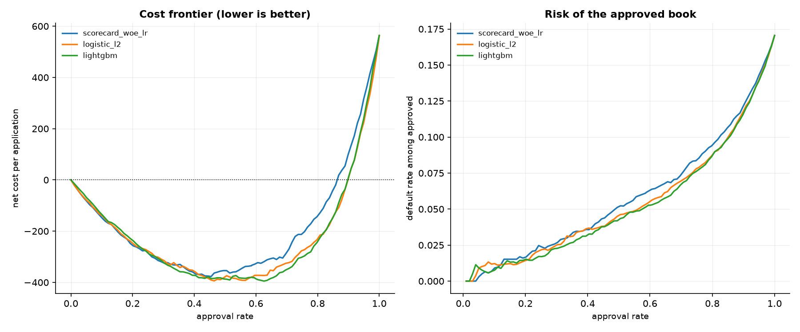
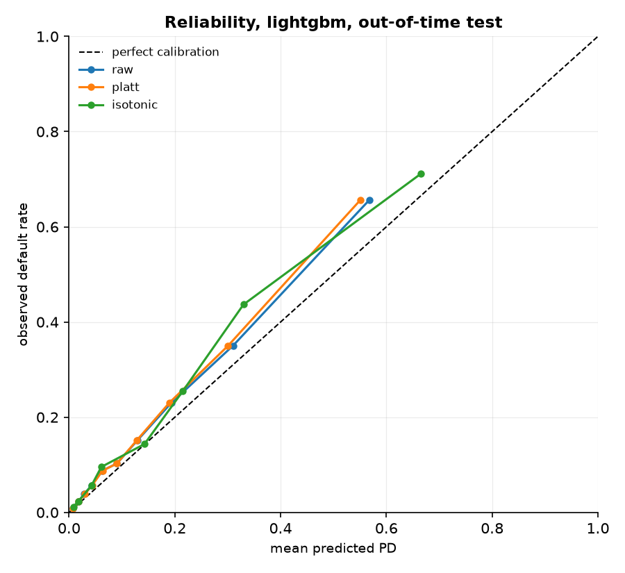
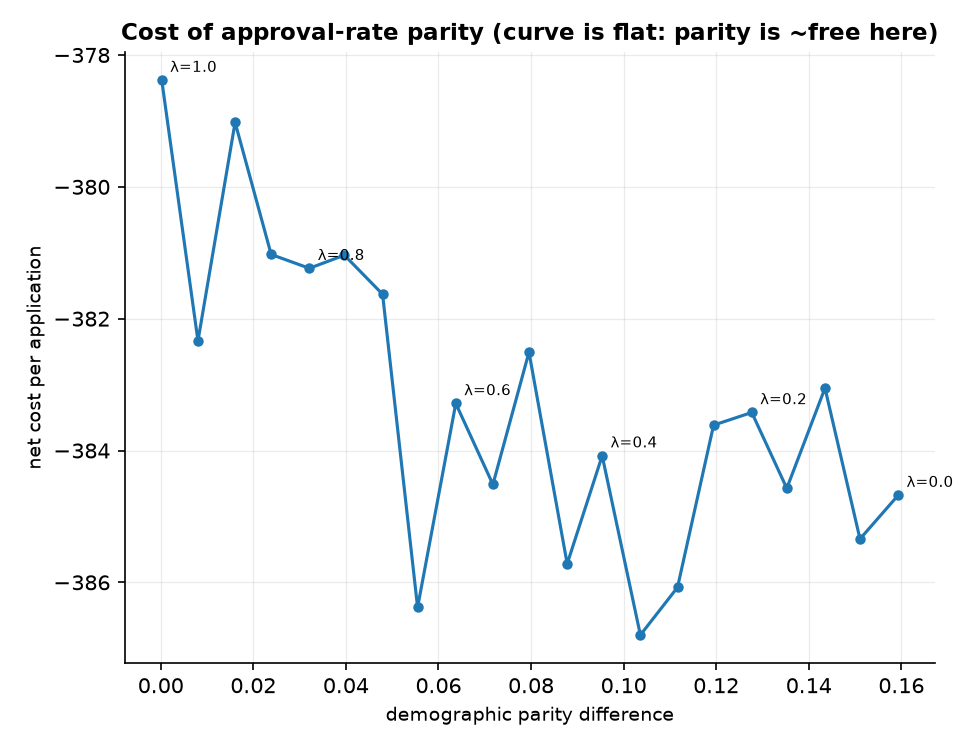
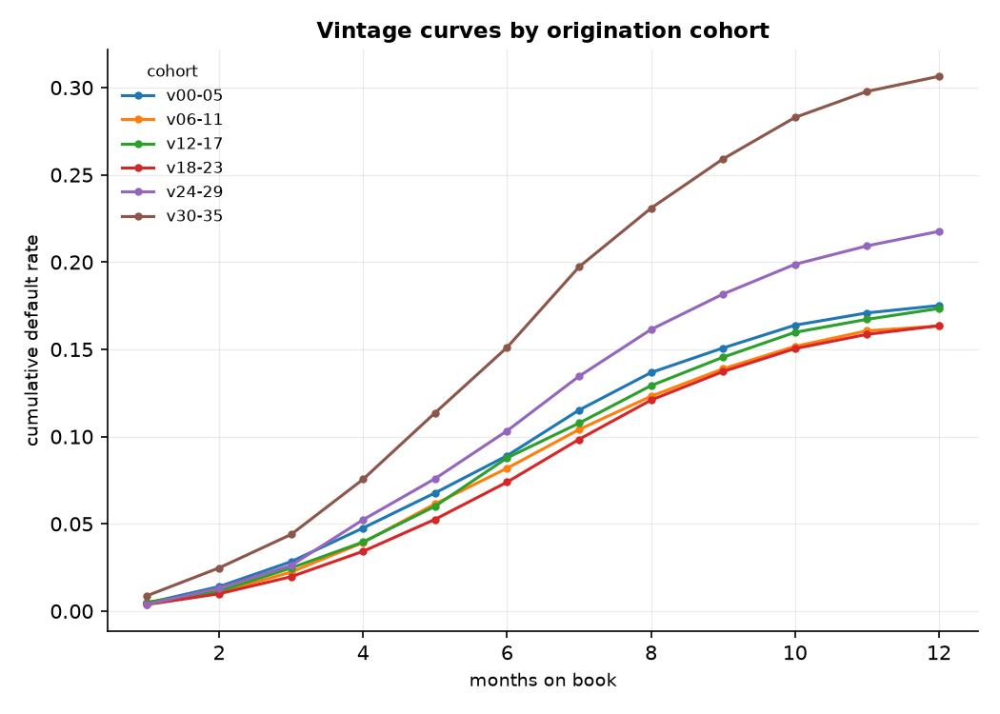

# Credit Risk Decisioning

A credit decisioning system, not a default-prediction notebook. It produces
calibrated probabilities of default, converts them into approve/decline
decisions under asymmetric cost, explains every decision in the language an
adverse action notice requires, audits itself for bias across protected
attributes, and confronts the selection bias baked into its own training data.

**The headline number is a cost, not an AUC.**

---

## Contents

- [What this is for](#what-this-is-for)
- [Results](#results)
  - [1. The headline: total cost](#1-the-headline-total-cost)
  - [2. The threshold is worth more than the model](#2-the-threshold-is-worth-more-than-the-model)
  - [3. Scorecard vs booster, decomposed](#3-scorecard-vs-booster-decomposed)
  - [4. Discrimination, and why accuracy is meaningless](#4-discrimination-and-why-accuracy-is-meaningless)
  - [5. Calibration](#5-calibration)
  - [6. Resampling bought nothing and cost everything](#6-resampling-bought-nothing-and-cost-everything)
  - [7. Reject inference: it depends, and you cannot tell on which](#7-reject-inference-it-depends-and-you-cannot-tell-on-which)
  - [8. Fairness audit](#8-fairness-audit)
  - [9. Monitoring: PSI missed it](#9-monitoring-psi-missed-it)
- [Explaining a decline](#explaining-a-decline)
- [Running it](#running-it)
- [Architecture](#architecture)
- [Known limitations](#known-limitations)

---

## What this is for

A lender approving unsecured consumer credit has to answer four questions about
every application, and only the first is a modelling problem:

1. How likely is this person to default? — a **calibrated probability**, not a
   ranking, because expected loss is `PD × LGD × EAD` and that identity
   consumes a probability.
2. Given what a default costs us and what a lost customer costs us, do we
   approve? — a **cost-optimal threshold**, not an F1-optimal one.
3. If we decline, what do we tell them? — **adverse action reason codes**, a
   legal obligation attached to an individual decision that must still hold
   months later.
4. Are we doing this fairly, and how would we know? — a **fairness audit** that
   reports the trade-off rather than silently picking a point on it.

Everything here is built and validated on a **synthetic loan book with known
ground truth**, because the two hardest claims in credit modelling — that
reject inference works and that a fairness audit detects real bias — are
unfalsifiable on real data. You never observe what a declined applicant would
have done.

> **This is a demonstration system. It is not fit for real lending decisions.**
> See [MODEL_CARD.md](MODEL_CARD.md) for out-of-scope uses.

### Data

**Synthetic** (`src/simulate.py`) — 30,000 applications across 36 monthly
origination vintages, with a known default-generating process, deliberate
population drift from vintage 24, a known fairness violation, a simulated past
approval policy, and retained ground truth for **everyone including the
declined**.

| | |
|---|---|
| Applications | 30,000 |
| Approval rate (legacy policy) | 70.0% |
| Population default rate | 19.96% |
| Default rate, approved | 12.41% |
| Default rate, declined *(unobservable on a real book)* | 37.57% |
| Out-of-time split | fit 12,095 / calibrate 2,389 / test 6,516 |

**Real** (`src/ingest.py`) — UCI Default of Credit Card Clients (30,000
accounts, Taiwan, 2005), which carries the protected attributes the fairness
work needs. It has **no origination dates**, so true vintage analysis is
impossible on it — not difficult, impossible, because the column does not
exist. See [Known limitations](#known-limitations).

---

## Results

All figures are **out-of-time**: models are fitted on vintages 0–19,
calibrated on 20–23, and tested on vintages 24–35, which contain the injected
drift. Reproduce with `python -m scripts.run_experiments`; every table below is
written to `reports/tables/`.

### 1. The headline: total cost

Cost assumptions: `LGD = 0.75`, net margin on a good account `= 9%` of
exposure, exposure = the applicant's actual requested loan amount. One missed
bad therefore costs **8.3 lost goods**.

Accounting is relative to writing no business: approve a good `+margin × EAD`,
approve a bad `−LGD × EAD`, decline `0`. Negative net cost is profit.

| Model | Approval rate | Bad rate approved | Margin earned | Realised loss | **Net cost** | Profit / application |
|---|---|---|---|---|---|---|
| **LightGBM** | 59.8% | 5.3% | 4,610,988 | 2,104,425 | **−2,506,563** | **384.68** |
| Logistic L2 | 59.9% | 5.4% | 4,553,154 | 2,088,075 | −2,465,079 | 378.32 |
| WOE scorecard | 59.9% | 6.4% | 4,721,967 | 2,553,600 | −2,168,367 | 332.78 |

**The scorecard gives up 338,196 on 6,516 applications — 13.5% of profit, or
about 52 per application.** That is a real gap and it is larger than the 2.3
AUC points between the two would suggest, because cost depends on ranking
precision *at the cutoff* and on calibration, not on average discrimination.

The brief anticipated that the scorecard would nearly match the booster. On
this book it does not, and reporting otherwise would be the dishonest move.
Whether 13.5% justifies giving up a monotone, additive, spreadsheet-auditable
model is a business judgement — but see [§3](#3-scorecard-vs-booster-decomposed),
because most of that gap is recoverable *without* giving up the scorecard.

### 2. The threshold is worth more than the model

The same LightGBM model, four ways of choosing the cutoff:

| Rule | Cutoff | Approval rate | Net cost | Excess vs best |
|---|---|---|---|---|
| Cost-optimal (empirical sweep) | 0.120 | 62.8% | −2,584,041 | 0 |
| Cost-optimal (closed form) | 0.107 | 59.8% | −2,506,563 | 77,478 |
| **F1-optimal** | 0.211 | 77.3% | −1,854,306 | **729,735** |
| **Naive 0.5** | 0.500 | 93.9% | **+1,227,921** | **3,811,962** |

Choosing the threshold by maximising F1 costs **729,735** — more than twice the
entire gap between the best and worst model in the table above. A naive 0.5
cutoff does not merely underperform, it **loses money outright**.

F1 weights false positives and false negatives equally. That is not a neutral
default; it is a specific and wrong cost assumption, applied silently.

The closed-form optimum `p* = margin / (margin + LGD) = 0.1071` is a property
of the **economics alone** — no model appears in it. The 77,478 gap between it
and the empirical optimum is the price of the model being miscalibrated on a
drifted book, measured in currency.

**The cutoff is an assumption, not a measurement.** Sweeping LGD from 0.45 to
0.90 and margin from 5% to 12% moves it from 0.053 to 0.211 and the approval
rate from 42% to 77% (`reports/tables/05_cost_sensitivity.csv`). Quoting a
cutoff to four decimals off one assumed LGD implies a precision that does not
exist.



### 3. Scorecard vs booster, decomposed

"The scorecard loses 2.3 AUC points" is not a finding until you know *what it
loses to*, because the remedies are completely different:

| Variant | Out-of-time AUC | Gap | What it isolates |
|---|---|---|---|
| Scorecard, 8 bins, monotonic **(deployed)** | 0.8148 | 0.0230 | the deployed configuration |
| Scorecard, 8 bins, *unconstrained* | 0.8144 | 0.0234 | cost of the monotonicity constraint |
| Scorecard, 20 bins, monotonic | 0.8227 | 0.0152 | cost of coarse binning |
| Logistic L2, continuous, additive | 0.8321 | 0.0058 | no binning, still additive |
| LightGBM, non-linear | 0.8379 | 0 | value of interactions and thresholds |

Three conclusions, and none of them is "use a booster":

- **Monotonicity is free.** Enforcing it costs 0.0004 AUC — nothing. The
  single most defensible property of a scorecard, the one that stops it telling
  an applicant that paying down their balance made them riskier, is available at
  no measurable cost.
- **Coarse binning costs 1.73 AUC points**, and finer bins recover about half.
  This is deliberate information loss bought for stability, and it is a dial,
  not a fixed property.
- **All the non-linearity is worth 0.58 AUC points.** The generator contains a
  real utilisation × delinquency interaction, a debt-to-income cliff and a
  thin-file step — planted specifically so the booster would have something to
  find. That is the entire return on abandoning additivity.

### 4. Discrimination, and why accuracy is meaningless

| Model | ROC-AUC | Gini | PR-AUC | KS | Brier | ECE | P@1% | P@5% | P@10% |
|---|---|---|---|---|---|---|---|---|---|
| LightGBM | 0.8379 | 0.6758 | 0.5736 | 0.5238 | 0.1042 | 0.0255 | 0.908 | 0.764 | 0.656 |
| Logistic L2 | 0.8321 | 0.6642 | 0.5646 | 0.5039 | 0.1059 | 0.0289 | 0.892 | 0.755 | 0.641 |
| WOE scorecard | 0.8148 | 0.6297 | 0.5156 | 0.4847 | 0.1112 | 0.0303 | 0.846 | 0.693 | 0.609 |
| *PR-AUC baseline (base rate)* | | | *0.1705* | | | | | | |

**Accuracy is meaningless here and the table says so out loud.** LightGBM
scores 0.857 accuracy at a 0.5 cutoff. Predicting "nobody ever defaults"
scores **0.829**. The model's entire apparent accuracy advantage over doing
nothing at all is 2.7 percentage points. Any credit model report leading with
accuracy is telling you about its base rate.

**Precision at review capacity** is the operationally real metric: a review
team works a fixed number of files per day. At 1% capacity, 91% of the flagged
files are genuine bads (5.3× lift); at 5%, 76%; at 10%, 66% while catching 39%
of all defaults.

### 5. Calibration

Three calibrators, evaluated two ways. The contrast is the point.

| Model | Calibrator | Brier | ECE | Slope | Intercept | Mean PD | Observed |
|---|---|---|---|---|---|---|---|
| **LightGBM** | **raw** *(selected)* | **0.1042** | **0.0255** | **1.035** | 0.305 | 0.145 | 0.171 |
| LightGBM | platt | 0.1046 | 0.0282 | 1.066 | 0.377 | 0.142 | 0.171 |
| LightGBM | isotonic | 0.1060 | 0.0251 | **0.726** | −0.176 | 0.145 | 0.171 |

**On this book, recalibration did not help.** The raw LightGBM output was
already well calibrated out of time, and the selection rule — prefer a slope
within 0.15 of 1.0, then lowest ECE — chose it over both alternatives. That is
a genuine result and it is reported rather than buried: fitting a calibrator is
not automatically an improvement, and isotonic's slope of 0.726 means it made
the model *more* overconfident.

The reason isotonic looks attractive and is not:

| Evaluated | Isotonic ECE | Isotonic slope |
|---|---|---|
| **In-period** (the data it was fitted on) | **0.0000** | 1.000 |
| **Out-of-time** (the data it will face) | 0.0251 | **0.726** |

A perfect 0.0000 in-period and a badly distorted slope out of time. This is
exactly why a calibrator is never evaluated on its own fitting data, and why
both views are reported.

**Every model under-predicts out of time**: mean predicted PD 0.145 against an
observed 0.171, a calibration intercept of about +0.30. That is the injected
drift, and **no calibrator fitted before the drift can fix it**. The
operational consequence is in [RUNBOOK.md](RUNBOOK.md): calibrators must be
refreshed on recent matured outcomes, not fitted once at build time.



### 6. Resampling bought nothing and cost everything

The received wisdom is that resampling trades calibration for ranking. On this
book it does not even manage the trade:

| Regime | ROC-AUC | PR-AUC | KS | Mean predicted | Observed | Bias | Brier | ECE |
|---|---|---|---|---|---|---|---|---|
| **none** | **0.8379** | **0.5736** | **0.5238** | 0.145 | 0.171 | −0.026 | **0.1042** | **0.0255** |
| class_weight | 0.8355 | 0.5716 | 0.5175 | 0.424 | 0.171 | +0.253 | 0.1864 | 0.2531 |
| SMOTE | 0.7829 | 0.4406 | 0.4232 | 0.390 | 0.171 | +0.220 | 0.1860 | 0.2197 |
| random undersample | 0.8238 | 0.5279 | 0.4875 | 0.450 | 0.171 | +0.279 | 0.2043 | 0.2790 |

- **Class weighting** leaves ranking untouched and inflates mean predicted PD
  from 0.145 to 0.424. ECE goes from 0.026 to 0.253, a 10× degradation.
- **SMOTE loses ranking too** — PR-AUC drops from 0.574 to 0.441. Interpolating
  between minority neighbours in a space of binned bureau variables manufactures
  applicants who do not exist.
- Every regime destroys calibration, because resampling changes the base rate
  the model is fitting to and every emitted probability inherits the distortion.

In a system whose output feeds `PD × LGD × EAD`, that is fatal — and completely
invisible if you only look at AUC. The imbalance here is real but mild, about
one bad in eight. Resampling is a treatment for a disease this book does not
have.

### 7. Reject inference: it depends, and you cannot tell on which

Training data has outcomes only for **approved** applicants. The model learns
`P(default | features, approved by the old policy)` and is deployed to answer
`P(default | features)`. Here approved accounts default at 12.4% and declined
applicants would have defaulted at 37.6%.

The study runs under **both selection regimes**, and they give opposite answers.

**MAR — the legacy policy used only features the model can also see**
(true in-band uplift **1.09**, assumed 2.5):

| Method | Mean PD on rejects | True rate | Bias | Brier | Bias removed |
|---|---|---|---|---|---|
| Baseline (approved only) | 0.389 | 0.439 | −0.051 | 0.1605 | 0% |
| Fuzzy augmentation | 0.541 | 0.439 | **+0.102** | 0.1712 | **−268%** |
| Parcelling | 0.542 | 0.439 | **+0.102** | 0.1732 | **−269%** |
| Heckman two-step | 0.358 | 0.439 | −0.082 | 0.1722 | −162% |
| *Oracle (true labels)* | *0.408* | *0.439* | *−0.031* | *0.1572* | *100%* |

**MNAR — a latent loan-officer signal drives both approval and default**
(true in-band uplift **1.90**, assumed 2.5):

| Method | Mean PD on rejects | True rate | Bias | Brier | Bias removed |
|---|---|---|---|---|---|
| Baseline (approved only) | 0.310 | 0.463 | −0.154 | 0.2010 | 0% |
| **Fuzzy augmentation** | 0.457 | 0.463 | **−0.007** | **0.1756** | **211%** |
| **Parcelling** | 0.472 | 0.463 | **+0.009** | 0.1764 | 208% |
| Heckman two-step | 0.318 | 0.463 | −0.146 | 0.2033 | **11%** |
| *Oracle (true labels)* | *0.379* | *0.463* | *−0.084* | *0.1795* | *100%* |

Four conclusions:

1. **Reject inference is not a free improvement.** Under MAR the baseline was
   already nearly unbiased — the oracle only moved reject bias from −0.051 to
   −0.031 — and the corrections *tripled* the bias by applying a 2.5× uplift
   where the truth was 1.09×.
2. **Under MNAR it genuinely works**: reject bias −0.154 → −0.007, Brier on
   rejects improving 13%.
3. **You cannot tell which regime you are in from a real book**, because the
   evidence that would settle it is the missing counterfactual itself.
4. **Heckman removed 11% of the bias at best** despite being handed a clean,
   valid exclusion restriction built specifically for it. A real deployment
   would not have one. That is evidence against the method here, not against
   this implementation.

**The trap.** The measured uplift depends on how good your *model* is, not just
on the selection mechanism. On the same MAR book:

| Training rows | Measured uplift | Baseline reject bias |
|---|---|---|
| 4,000 | 2.25 | −0.120 |
| 10,000 | 1.21 | −0.059 |
| 20,000 | 1.09 | −0.051 |

Nothing about selection changed. A weak model leaves risk heterogeneity inside
each score band, and because the old policy sorted on that heterogeneity,
rejects within a band really are worse. **Measuring a 2× uplift on your own
book is not evidence that you need reject inference** — it is equally
consistent with an underpowered model, and the two are not distinguishable from
the uplift figure alone.

### 8. Fairness audit

No model receives `group`, `age_band`, `sex`, `education` or `marriage` as an
input. The disparities are large anyway, because protected attributes have
proxies. "We do not use gender" describes the feature list, not the outcome.

| Attribute | DPD | Adverse impact ratio | Equal opportunity difference | Worst group ECE |
|---|---|---|---|---|
| **group** | 0.159 | **0.755** ⚠ | **0.136** ⚠ | 0.027 |
| **age band** | 0.434 | **0.451** ⚠ | **0.369** ⚠ | **0.069** ⚠ |

Group A is approved 65.1% of the time, group B 49.2%. The adverse impact ratio
of 0.755 is below the four-fifths screening level. The equal opportunity
difference of 0.136 means **creditworthy group B applicants are declined 13.6
percentage points more often than equally creditworthy group A applicants** —
that one is much harder to explain away as a legitimate risk difference.

**Separating real risk from manufactured risk.** This is the question a real
audit cannot answer and must instead argue about. Here the ground truth exists:

| Group | True mean PD | Predicted mean PD | True gap | Predicted gap | **Model excess** |
|---|---|---|---|---|---|
| A | 0.1535 | 0.1221 | — | — | — |
| B | 0.2013 | 0.1901 | 0.0478 | 0.0679 | **+0.0202** |

The groups genuinely differ in risk by 4.8 points. The model asserts 6.8. **The
extra 2.0 points is manufactured** — it is the injected income measurement
bias, where recorded income understates group B's true income by 15% while true
risk depends on true income. The model never sees `group` and cannot see the
bias either; dropping the protected attribute does nothing about it.

**The trade-off.** Interpolating from a single global cutoff (λ=0) to equal
approval rates (λ=1):

| λ | Approval rate | Net cost | DPD | AIR | EOD |
|---|---|---|---|---|---|
| 0.0 | 59.8% | −2,506,563 | 0.159 | 0.755 | 0.136 |
| 0.4 | 59.8% | −2,502,660 | 0.095 | 0.849 | 0.063 |
| **0.8** | 59.8% | −2,484,132 | 0.032 | 0.947 | **0.004** |
| 1.0 | 59.8% | −2,465,535 | **0.000** | **1.000** | 0.037 |

**Full approval-rate parity costs 41,028 — 1.64% of profit.** The curve is
essentially flat and non-monotone, so the honest reading is "parity costs about
nothing here", **not** "λ=0.7 is optimal". A bumpy flat curve has no peak.

Note that **equal opportunity is minimised at λ=0.8 and rises again at full
parity**. Equalising approval rates across groups with different base rates
necessarily unequalises the rate at which creditworthy applicants are approved.
You cannot have both.



#### Which point would I choose, and why

**λ = 0: a single cutoff for everyone.** Not because the disparity is
acceptable — it is not — but because group-specific cutoffs are the wrong
instrument:

1. **They are probably unlawful.** In most jurisdictions applying a different
   threshold *because of* a protected characteristic is disparate treatment,
   whatever it does to the disparity statistics. The curve above prices the gap;
   it is a diagnostic, not a deployment proposal.
2. **They do not fix the actual defect.** `max_group_ece` is invariant to λ by
   construction — calibration is a property of the probabilities, not the
   cutoff. Every point on that curve is built on probabilities that are wrong
   for group B by 2.0 points. Moving thresholds redistributes decisions without
   repairing the numbers underneath.
3. **The defect is upstream and fixable.** The measured excess traces to income
   capture. The right remedy is to fix how income is recorded for group B, then
   re-audit — which costs nothing in fairness/accuracy trade-off terms because
   it removes the error rather than offsetting it.

So: deploy at λ=0, escalate the adverse impact and equal opportunity findings to
the model risk committee, fix income capture, and re-audit. If the measurement
fix proves impossible, the next option is a group-blind remedy — re-engineer or
drop the features carrying the proxy signal — and only then reconsider.

**This is a policy decision, not a technical one.** A different institution,
with different legal advice and a different risk appetite, could look at the
same table and reasonably choose differently. What is not reasonable is making
the choice silently inside a model.

### 9. Monitoring: PSI missed it

The book contains a large deliberate deterioration. **Vintage analysis sees it
immediately:**

| Cohort | 12-month default rate | vs first cohort |
|---|---|---|
| v00–05 | 17.51% | — |
| v06–11 | 16.34% | −6.7% |
| v12–17 | 17.34% | −1.0% |
| v18–23 | 16.36% | −6.6% |
| v24–29 | 21.76% | **+24.3%** |
| v30–35 | **30.65%** | **+75.0%** |

**The conventional input-drift monitoring did not fire:**

| Indicator | Value | Threshold | Status |
|---|---|---|---|
| Score PSI | 0.103 | 0.25 | watch, **not breached** |
| Worst feature PSI (`credit_history_months`) | 0.212 | 0.25 | watch, **not breached** |
| Calibration ECE | 0.026 | 0.05 | within tolerance |
| **Combined watch** | — | 0.10 | **BREACHED** |

A framework operated strictly on PSI ≥ 0.25 would have raised **nothing** while
realised losses rose by three quarters.

The response is not to lower the threshold until it fires on this incident —
that is fitting the governance to the accident. It is:

1. **Input drift metrics are a prompt, not a safety net.** PSI answers "did the
   applicants change?" The damage here came mostly from a change in the
   *relationship* between features and default, which no input-side metric can
   see by construction.
2. **The lagging indicator is the one that settles it, and it is slow.** There
   is no way to make vintage performance arrive faster; size the exposure taken
   between review points accordingly.
3. **Escalate on combined watch.** Two indicators in the watch band at once, in
   the same direction, is itself a finding. That rule is implemented in
   `evaluate_triggers` and it is the only thing that fires here.



---

## Explaining a decline

A worked example, end to end, taken from the out-of-time test set. The system
picks the decline **closest to the cutoff**, because the marginal case is the
one that has to be defensible — obvious declines explain themselves.

**Application 27565**

| | |
|---|---|
| Calibrated PD | 0.10715 |
| Cutoff in force | 0.10714 |
| Scorecard score / band | 574.6 / **C** |
| Exposure at default | 17,600 |
| Expected loss | 1,414.45 |
| Expected value | **−0.18** |
| Decision | **decline** |

Expected value of −0.18 on a 17,600 exposure: this applicant sits within twenty
pence of break-even. That is what a cost-optimal cutoff means in practice, and
it is why the reasons given have to be right.

```
NOTICE OF ADVERSE ACTION

We are unable to approve your application for credit at this time.

The principal reasons for our decision are:
  1. The income recorded on your application is low relative to the amount requested
  2. Your total debt repayments are high relative to your income
  3. Your balances are high relative to your available credit limits
  4. You have been in your current employment for a short time

Decision reference: model experiment-run, cutoff 0.1071.
```

Two reason-code methods are implemented and they **do not always agree** beyond
the top two, which matters when the output is a legal notice:

- **Points shortfall** (deployed) — compares awarded points against the best
  achievable on each characteristic. Reproducible forever from the printed
  points table, with no model artefact required.
- **SHAP contributions** — works for any model, but depends on a background
  dataset that must be versioned alongside the model to reproduce the
  explanation later.

Reason codes derived from protected or protected-adjacent characteristics
(`age`) are returned flagged `protected_basis: true` rather than being emitted
silently onto a letter. SHAP duly flagged `age` on this example; points
shortfall did not.

Every decision is written to an **append-only audit log** before the response is
returned: timestamp, input hash, score, band, decision, reason codes, model
version and the threshold in force. See
[RUNBOOK.md](RUNBOOK.md#4-retrieve-the-audit-trail-for-a-declined-applicant).

---

## Running it

```bash
python -m venv .venv && source .venv/bin/activate
pip install -e ".[dev]"

# Everything: experiments, tables, figures, and the deployable artifact.
python -m scripts.run_experiments          # add --quick for a fast pass

# Tests (synthetic data only, no network)
pytest tests/ -q                           # 223 tests, ~40s
pytest tests/test_calibration_gate.py -v   # the calibration regression gate

ruff check src/ tests/ scripts/ && mypy src/

# Serve
uvicorn src.api.main:app --port 8000
curl localhost:8000/health
curl localhost:8000/model-info

# Batch, through the same code path as the API
python -m scripts.score_batch --demo

# Container: model and calibrator baked in from one training run
docker compose up --build
docker compose --profile batch run --rm batch

# Real data (requires network access to archive.ics.uci.edu)
python -m src.ingest
```

---

## Architecture

```
src/
  simulate.py          synthetic book with known DGP, drift, injected bias,
                       past approval policy, and ground truth for everyone
  ingest.py            idempotent UCI download, checksum, schema validation
  scorecard.py         WOE binning + logistic regression -> points scorecard
  models.py            LightGBM, L2 logistic, scorecard behind one interface
  calibration.py       raw / Platt / isotonic; Brier, ECE, MCE, slope
  evaluation.py        PR-AUC, precision@capacity, KS, Gini, resampling test
  policy.py            cost model, threshold sweep, approval/loss frontier
  reject_inference.py  fuzzy augmentation, parcelling, Heckman, oracle
  fairness.py          disparity, within-group calibration, trade-off curve
  explain.py           SHAP + adverse action reason codes
  monitoring.py        PSI, vintage curves, review triggers
  artifacts.py         versioned bundles; refuses a mismatched pair
  engine.py            THE decision path -- API and batch both call this
  api/                 FastAPI service + append-only audit log
scripts/
  run_experiments.py   full programme -> reports/ + artifacts/
  score_batch.py       portfolio scoring through the same engine
```

Two invariants are enforced by tests rather than convention:

- **The API and batch scorer cannot drift apart.** Both call
  `DecisionEngine.decide` and neither implements scoring logic.
  `test_api_and_batch_produce_identical_decisions` scores the same applicants
  both ways and requires byte-identical results.
- **A model and its calibrator cannot be separated.** They carry a shared
  `training_run_id`, verified on load along with content hashes. The service
  **refuses to start** on a mismatch — a service that is down is an incident
  someone notices in minutes; one quietly serving miscalibrated probabilities
  is not, because AUC is untouched by the mismatch.

---

## Known limitations

**The headline results are from synthetic data.** The synthetic book was built
so reject inference and fairness could be validated against ground truth, which
is impossible on real data. It is a model of a credit book, not a credit book.
Its coefficients, base rates and the size of every effect reported above are
properties of a generator I wrote. Nothing here transfers numerically to a real
portfolio.

**The UCI dataset could not be downloaded in this environment.** The archive
host is blocked by the egress policy where this was developed, so the real-data
path in `src/ingest.py` is implemented, schema-validated and tested against a
fixture built to the published layout, but has **not been run against the actual
file**. The checksum is therefore trust-on-first-use rather than pinned, and
this is stated in the module rather than hidden behind a hard-coded constant
nobody verified.

**UCI cannot support vintage analysis at all.** It carries six months of
repayment history and no origination dates. Cohorts cannot be reconstructed.
For that dataset the code builds a *pseudo*-out-of-time design using only the
earliest three months of history — which catches leakage but **cannot test
drift robustness**, the main reason temporal validation exists. That capability
lives on the synthetic book, which is precisely why it was built first.

**UCI's outcome window is one month**, a far weaker definition of default than
the 90-days-past-due at 12 months a lender would use, and it is one issuer in
one market in 2005.

**The exclusion restriction is a gift.** `branch_capacity_index` affects
approval and not default by construction. Real books rarely have one, which is
a large part of why Heckman corrections disappoint — and the 11% figure here
should be read as an *upper bound* on how well the method can do.

**All accounts are fully seasoned.** The generator takes its snapshot 12 months
after the last origination, so every vintage is mature. A real book has an
immature tail that complicates every number in the monitoring section.

**LGD, EAD and margin are assumed, not estimated.** A real system would model
LGD from collections performance and EAD from limit utilisation at default,
each with its own error. The sensitivity grid in
[§2](#2-the-threshold-is-worth-more-than-the-model) shows how much the answer
moves when they are wrong; it does not make them right.

**`age` is a model feature and a protected basis.** It is retained because it
is genuinely predictive and present in both datasets, and reason codes derived
from it are flagged for legal review. A real deployment would have to settle
this before launch, not after. See [DECISIONS.md](DECISIONS.md).

**The audit log is a local file.** It demonstrates the contract — append-only,
fsync'd, retrievable by applicant — without pretending to satisfy a
records-retention policy. A real deployment needs WORM storage with retention
locks, replication, and gap monitoring.

**Fairness is measured on two attributes on synthetic data.** Real audits cover
more attributes, intersections of attributes (which are where the worst
disparities usually hide), and geography. No intersectional analysis is done
here.

---

## Further reading

- [MODEL_CARD.md](MODEL_CARD.md) — intended use, training data, performance by
  subgroup, ethical considerations, out-of-scope uses
- [DECISIONS.md](DECISIONS.md) — every judgement call and its reasoning
- [RUNBOOK.md](RUNBOOK.md) — change the cutoff, roll back a model, re-run the
  fairness audit, retrieve an applicant's audit trail

## Licence

MIT.
